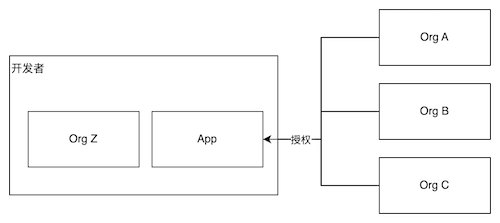

# 开发、安装与运行
## 本地开发安装

### 方式一 使用 pip 进行本地安装
在代码根目录运行安装，将本地代码包进行安装，安装完成之后可以运行命令行
```shell
# 进行安装
pip install -e .

# 执行命令
cobo

# 执行子命令(config)，配置参数(number=100)
cobo --enable-debug config set number 100
```

### 方式二 使用 python 命令直接运行
首先配置 PYTHONPATH，package 目录即为代码根目录（也就是 setup.py 所在目录）

```shell
# 配置路径
export PYTHONPATH=$PYTHONPATH:/path/to/your/package

# 执行命令
python -m cobo_cli.commands

# 执行子命令(config)，配置参数(number=100)
python -m cobo_cli.commands --enable-debug config set number 100
```

## 代码开发指南

命令行工具基于 [click](https://click.palletsprojects.com/en/8.1.x/) 来开发的

[commands.py](./cobo_cli/commands.py) 是程序入口，其他 *_commands.py 为子命令

命令使用 env_file 来存储数据，通过 ctx 对象在可以访问其的数据。

ctx.obj 在 commands.py 中由 `ctx.ensure_object(CommandContext)` 进行初始化，后续可以通过 ctx.obj.env_manager 来调用

CommandContext 另一个参数为 env ，代表所想使用的环境（Dev, Prod）

#### 命令的参数有以下几种：

 - 子命令: 如 `config` 子命令，分为子命令组(`config`)和直接的子命令(`login`)。默认情况下直接的子命令显示帮助信息，但是像`login`这种直接的子命令会直接执行
 - 选项: 即 option，例如 `keys` 命令下的 `--key-type` 指定不同类型；又如 主命令下的 `--enable-debug` 通过添加与否来指定flag
 - 参数: 即 argument，例如 `config` 命令下的 `set` 子命令 后跟的 `key` 与 `value`

#### 单元测试
单元测试中需要注意的有两点

1) 使用 CliRunner 来 invoke 相应的命令
2) 使用 isolated_filesystem() 方法可以临时创建工作目录，用于文件的保存。
    由于本程序使用 .env 文件，所以这步是必要的，防止 dotenv 库无法正常识别和找到 .env 文件

## 命令介绍

命令执行前假设已经通过 `pip install -e .` 安装至当前虚拟python环境。

在执行时可以在主命令后追加 `--enable-debug` 参数显示debug级别日志，

#### config 命令
将参数设置到 .env 文件中

```shell
cobo config set number 100
```
```shell
cobo config get number
```
```shell
cobo config unset number
```

#### keys 命令

##### generate 子命令
生成 API/APP keypair，并存储到 .env 文件中

```text
cobo keys generate --help
Usage: cobo keys generate [OPTIONS]

Options:
  --key-type TEXT  Specify the key used for API or APP.
  --alg TEXT       Specify the key generation algorithm.
  --force          Force to replace existing keys.
  --help           Show this message and exit.
```

如果 .env 中已经存在对应的 API/APP 的 key，则需要添加 --force 选项才能进行生成

```shell
cobo keys generate --key-type APP --alg ed25519
```

```shell
cobo keys generate --key-type APP --alg ed25519 --force
```

#### login 命令

```text
cobo login --help
Usage: cobo login [OPTIONS] COMMAND [ARGS]...

Options:
  -u, --user       login action associated with user dimension. default
                   login_type.
  -o, --org        login action associated with org dimension.
  --org-uuid TEXT  Specify the org id used for retrieve token.
  --refresh-token  Refresh token.
  --help           Show this message and exit.
```

##### Org Token
获取 org token (org 授权给 App 的 Access Token 和 Refresh Token)

获取 Org Token 的前提是，Org 已经完成了对当前 App 的授权



1) 生成 APP_KEY/APP_SECRET，在 Cobo Portal 创建应用过程来配置 APP_KEY 
    ```shell
    cobo keys generate --key-type APP --alg ed25519
    ```

2) 将从 Cobo Portal 中注册完应用获取到的 CLIENT_ID 保存到 .env 文件中
    ```shell
    cobo config set CLIENT_ID aYkam0BPwJrduDU3Wqu89htGDHy4ATkV
    ```

3) Org 对 App 进行授权（Org 安装应用），并进行审核。此步骤需要进行授权的 Org(大概率不是开发者自己的Org) 在 Cobo Portal的后台中进行操作。

   > 理论上开发者可以将自己的 Org 对自己的 App授权，但是开发者开发 App 更多的是为了一般性地供其他 Org 使用。
   > 
   > 如果只是为了自己 Org 使用，直接使用 API KEY 相关功能即可。

4) Org 完成应用的安装之后，App 便得到了 Org 的授权，此时可以获取此 Org 相关的 Token

   - 获取 Access Token、Refresh Token，并存储
   ```shell
    cobo --env sandbox login -o --org-uuid 02273047-5730-4b63-be0e-399e5d3a1054
    ```
   - 刷新 Token，并存储
   ```shell
    cobo --env sandbox login -o --org-uuid 02273047-5730-4b63-be0e-399e5d3a1054 --refresh-token
    ```

##### User Token

使用 -u 参数进行用户身份级别的登录，登录完成后会获取到 USER ACCESS TOKEN 用于后续请求

```shell
cobo --env sandbox login -u
```
```shell
cobo --enable-debug --env sandbox login -u
```

